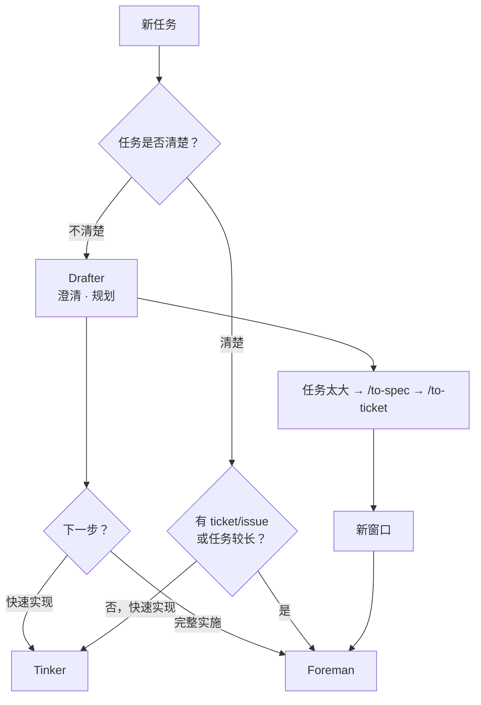
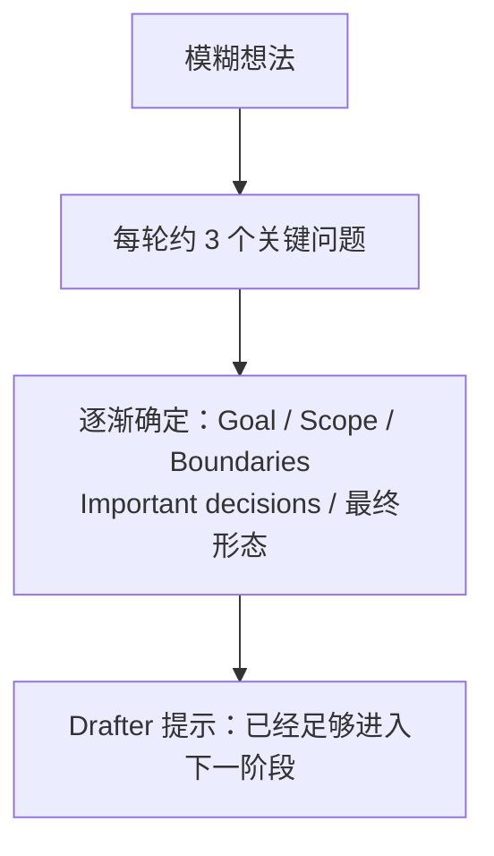
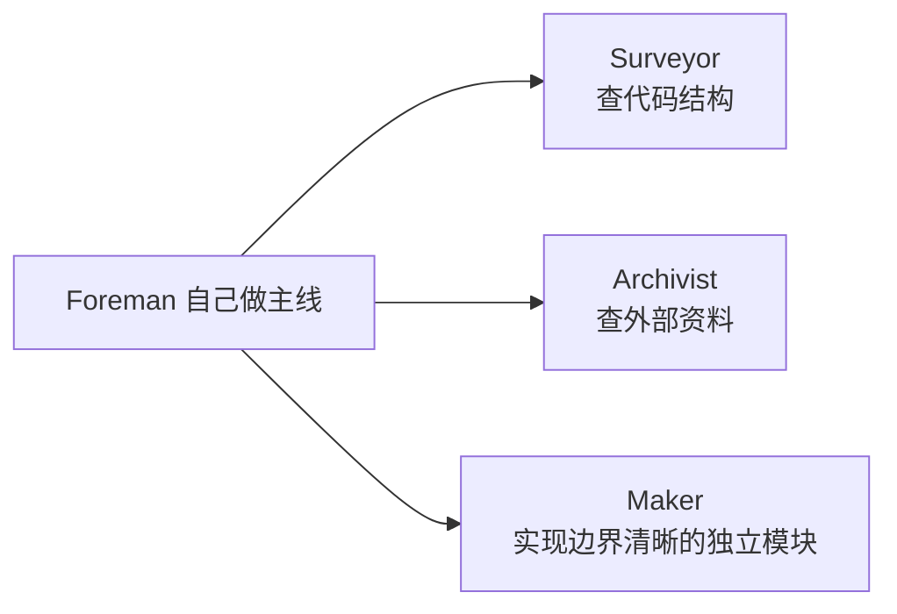
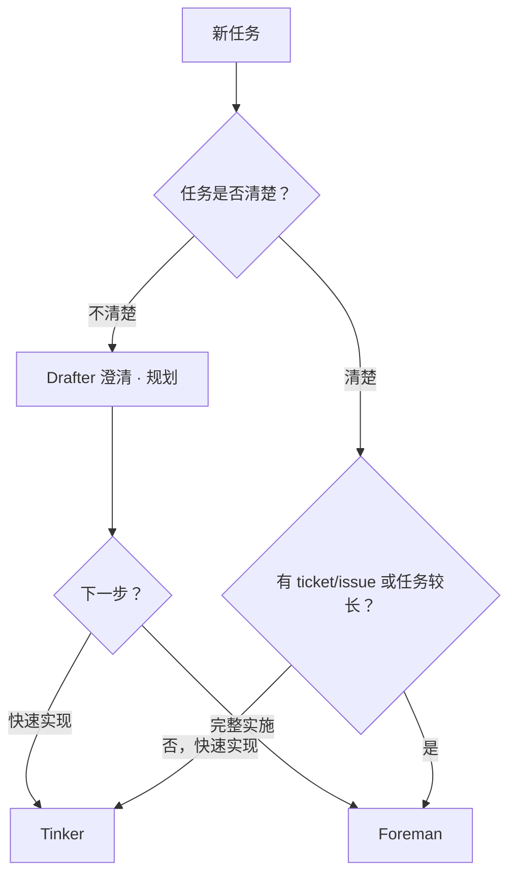

# OpenCode Matt Workshop

独立的 OpenCode Server 插件：以 Matt Pocock Skills `v1.2.2` 的全部 25 个 Promoted Skills 为基础，提供一套**克制、手动控制、按需增加能力**的 OpenCode 工作流。

这不是一个"自动判断任务复杂度然后自己切档"的大框架。核心只有三个角色，由你手动选择：

- **Drafter** — 把事情想清楚（澄清决策、产出 Implementation Plan）
- **Tinker**（默认）— 清楚的事情快速实现
- **Foreman** — 有 ticket/issue 或任务较长时的完整实施



## Drafter：只负责"我到底想做什么"

Drafter 按 Matt Pocock 的 grilling 思路工作。它不是一上来就写 implementation plan，而是**逐层问真正影响设计的问题**：



**不自动切换角色**。关键路径就一条：先想清楚，再选实现者。

| 你的处境 | 选择 |
| --- | --- |
| 不清楚的事情 | Drafter →（快速实现 → Tinker / 完整实施 → Foreman） |
| 清楚的事情，快速实现 | Tinker（默认） |
| 有 ticket/issue，或任务较长 | Foreman |
| 任务太大 / context 太长 | `/to-spec` → `/to-ticket` → 新窗口 → Foreman `/implement` |

`to_spec → to_ticket` 的作用是**把大任务持久化，然后清空上下文重新执行**。它不是每个任务都必须经过的路径。

## Tinker：低摩擦直接实现

Tinker 解决的是"本来实现 10 分钟，结果测试 + 修测试搞了两个小时"的问题。

哲学：**implementation first，低成本验证，不扩张任务**。

它自己读代码 → 自己修改 → 自己做廉价检查 → 结束。

默认：

- 不委派
- 不新增 test
- 不新增测试框架
- 不因为一个简单修改开始补 regression suite
- 不跑昂贵的全量 test suite

但不是"完全不验证"——**能快速 compile 就 compile，有快速 typecheck 就 typecheck，format/lint 几秒钟可以跑**。

验证原则浓缩成：**Existing + Targeted + Bounded**

> 使用已有的、针对当前修改的、时间有界的验证。一旦"验证"开始变成另一项开发任务——停。

这就是 Tinker 的边界。

## Foreman：不是 manager，而是"有调度能力的实现者"

Foreman 自己仍然：

- 看代码
- 写主线
- 改文件
- 调试
- 整合结果

**只有 delegation 真的带来收益才叫子 Agent。** 目前确定两个触发理由：

- **A. 可以真正并行**
- **B. specialist 明显更适合**

例如：



而不是："我是 Foreman → 所以什么都必须 delegate"。

一句话：**Delegate for leverage, not by default.**

## Tinker 和 Foreman 的真正区别

不是：

- Tinker = 随便做，Foreman = 严格做
- Tinker = 不测试，Foreman = TDD

而是：

- **Tinker** = 不委派，直接实现
- **Foreman** = 主线自持，按需委派

测试、review、TDD 暂时都**不绑定角色**，以后真的遇到问题再加。

> 先不要设计一个完整理论体系；缺什么，加什么。

## Worker 边界

- **不做 worktree orchestration**：所有子 Agent 共享同一个 repo / working tree。
- 依靠提示词约束 Worker：只修改 assigned scope、不随便动其他模块、不 revert 别人的修改、不自行 commit / reset、发现冲突就报告。
- 最后由 Foreman 做 Git coordination：`git diff` → 看各 agent 修改 → 简单检查 → 整合。
- 第一版不做复杂 worktree management。

## 子 Agent 必须有生命上限

组合使用：

| 层 | 机制 |
| --- | --- |
| Agent | `steps` 上限 |
| Shell | `timeout`（单条命令不能无限执行） |
| Prompt | 连续尝试没有产生新信息 → 不要机械重试，返回 Foreman 汇报阻塞点 |

形成：**soft no-progress limit + hard ceiling**。

只有以后依然出现严重 stall，才值得写真正的 progress watchdog（检测 diff / error / progress，然后 abort child session）。**现在不做。**

## 设计原则（总结）

- Thinking 和 implementation 分开。
- 是否委派是 implementation strategy，不是质量等级。
- Drafter 不自动替你决定下一步。
- Tinker 追求低摩擦。
- Foreman 自己干主线，只在有收益时委派。
- 不默认 TDD，不默认大量 tests。
- 验证成本不能反客为主。
- Worker 不能无限运行。
- 不先造完美框架，实际遇到 friction 再增加机制。

## 角色与当前实现

本插件注册三个 Primary Agent 与四个 Worker Subagent：

| 角色 | 配置键 | 职责 |
| --- | --- | --- |
| Drafter | `drafter` | 澄清决策、逐层问关键问题、产出规划产物；不实施 |
| Tinker | `tinker`（默认） | 直接实现，Existing + Targeted + Bounded 验证；不委派 |
| Foreman | `foreman` | 自己实施主线，仅在并行 / specialist leverage 明确时委派 |

另注册四个边界明确的 Worker Subagent 供 Foreman 委派：`maker`（实施有界单元）、`inspector`（只读审查）、`archivist`（调研并写报告）、`surveyor`（只读代码映射）。Worker 默认 steps 为 Maker 40、Inspector 24、Archivist 20、Surveyor 32，且连续三轮无进展时停止汇报。

## Configuration

最简配置：

```jsonc
{
  "$schema": "https://opencode.ai/config.json",
  "plugin": [
    "./opencode-zh-bundle/plugins/opencode-matt-workshop/dist/src/index.js"
  ]
}
```

可选的角色覆盖只支持 `model`、`variant`、`temperature`、`steps`：

```jsonc
{
  "plugin": [
    [
      "./opencode-zh-bundle/plugins/opencode-matt-workshop/dist/src/index.js",
      {
        "agents": {
          "drafter": { "model": "openai/gpt-5.6-sol", "variant": "high" },
          "tinker": { "model": "opencode-go/deepseek-v4-flash", "variant": "high" },
          "foreman": { "model": "openai/gpt-5.6-terra", "variant": "high" },
          "maker": { "model": "opencode-go/deepseek-v4-flash", "variant": "max" },
          "inspector": { "model": "opencode-go/mimo-v2.5" },
          "archivist": { "model": "openai/gpt-5.6-luna", "variant": "medium" },
          "surveyor": { "model": "opencode-go/mimo-v2.5" }
        }
      }
    ]
  ]
}
```

这些模型只是推荐，不是运行时默认值。未配置时，每个角色继承 OpenCode 当前模型。DeepSeek V4 Flash 不能接收图片或 PDF；附件任务应临时覆盖为支持附件的模型。`opencode-go/mimo-v2.5` 无 variant 档（只有默认），配置时省略 `variant` 字段；有 variant 档的模型（如 deepseek-v4-flash 的 low/high/max）才写 variant。

## How to use

### 使用流程一览



### 第一步：安装

1. 把插件加入 `~/.config/opencode/opencode.jsonc` 的 `plugin` 数组（见 [Configuration](#configuration)，可选 tuple options 配模型）。
2. 完全退出并重新启动 OpenCode（配置只在启动时加载，不会热重载）。
3. 验证：`opencode debug agent tinker` 应显示 Tinker 角色。

### 第二步：进入 Drafter（想清楚）

1. 在 OpenCode TUI 中切换到 `drafter`（Drafter）。
2. 用自然语言描述你的模糊想法，不用先整理好。
3. Drafter 会按 grilling 思路**每轮问约 3 个关键问题**，逐层逼近真正影响设计的东西。
4. 回答几轮后，Drafter 提示"已经足够进入下一阶段"。
5. **切换由你手动完成**——Drafter 不会自动开始实现。

### 第三步：选择实现路径

#### 路径 A：Tinker（快速实现）

- **场景**：改动清晰、范围小、想快速完成。
- **怎么切**：TUI 切换到 `tinker`（默认就是它，通常无需切换）。
- **它会**：自己读代码 → 修改 → 廉价检查（能快速 compile 就 compile、有快速 typecheck 就 typecheck、format/lint 几秒可以跑）→ 结束。
- **边界**：不委派、不新增测试、不跑全量 suite；一旦"验证"开始变成另一项开发任务就停。

#### 路径 B：Foreman（完整实施）

- **场景**：有 ticket/issue、范围大、可并行、需要外部资料或边界清晰的独立模块。
- **怎么切**：TUI 切换到 `foreman`。
- **它会**：自己写主线；只有"真并行"或"specialist 明显更合适"时才派 Worker。
- **委派前**：声明 Delegation Leverage、Assigned Scope、预期结果。

#### 路径 C：大任务持久化（清空上下文）

任务太大 / context 太长时：

1. 在 Drafter 中运行 `/to-spec` —— 把已讨论内容合成规格。
2. 运行 `/to-ticket` —— 拆成带阻塞关系的 tickets。
3. 开新窗口，切换到 Foreman 运行 `/implement`。
4. 新窗口的 Foreman 根据 spec / tickets 实施，旧 context 不再拖累。

`/to-spec` → `/to-ticket` 不是每个任务都必须经过；它专门解决"大任务 + 长上下文"。

### 第四步：Worker 一览（委派或直接调用）

| Worker | 做什么 | 何时用 | 访问方式 |
| --- | --- | --- | --- |
| `maker` | 实施一个边界清晰的独立模块 | Foreman 需要并行实现 | 隐藏，仅通过委派 |
| `inspector` | 只读审查 Standards / Spec 一个维度 | 实现完成后需要独立审查 | 隐藏，仅通过委派 |
| `archivist` | 调研一手资料并写带引用的报告 | 需要外部资料、文档、API 事实 | 可见，可直接 `@archivist` |
| `surveyor` | 只读映射代码结构、约定与关系 | 需要先摸清代码库再动手 | 可见，可直接 `@surveyor` |

所有 Worker：共享 working tree、只改 assigned scope、不自行 commit/reset、连续三轮无进展即停止汇报、受 `steps` 上限约束。

### 常用命令一览

| 命令 | 用途 | 何时用 |
| --- | --- | --- |
| `/ask-matt` | 让插件推荐当前处境最合适的 Skill | 不确定该用哪个工作流 |
| `/to-spec` | 把当前对话合成规格并发布到 tracker | 大任务持久化第一步 |
| `/to-ticket` | 把规格拆成带阻塞关系的 tickets | 大任务持久化第二步 |
| `/implement` | 按 spec / tickets 实施 | Tinker 或 Foreman 下运行 |
| `/tdd` | 测试驱动开发 | 仅当你明确选择 seams/behaviors 后 |
| `/code-review` | Standards + Spec 双轴审查 | 实现完成后收尾 |
| `/matt-handoff` | 生成交接文档供新会话继续 | 需要换窗口 / 换 Agent |

### 验证边界速查

| 层级 | Tinker | Foreman |
| --- | --- | --- |
| 验证方式 | 已有的、针对当前修改的、时间有界的 | 同左；委派 Worker 时各 Worker 自带验证 |
| 测试 | 默认不新增、不跑全量 suite | 同左 |
| 停止条件 | 验证变成另一项开发任务 → 停 | 同左 |
| Worker | 不调用 | 按 leverage 调用，受 steps / timeout / no-progress 约束 |

### 常见问题

- **角色会不会自动切换？** 不会。Drafter 只提示"已足够进入下一阶段"，切换永远由你手动完成。
- **为什么默认是 Tinker？** 低摩擦优先；有 ticket/issue 或任务较长时手动切 Foreman。
- **怎么给角色配模型？** 见 [Configuration](#configuration) 的 tuple options。
- **Worker 卡住了怎么办？** 有 steps + timeout + no-progress 上限，会自行停止并汇报阻塞点；严重时可重启会话。
- **必须每次都用 Drafter 吗？** 不是。只有想法模糊时才需要；清晰的改动可以直接在 Tinker / Foreman 开始。

## Workflow Skills

- 全部 25 个 Promoted Skills 注册为同名 Workflow Command；Matt 的 handoff 使用 `/matt-handoff`，避免与 OpenCode 内置 `/handoff` 冲突。
- `/implement` 在 Tinker 中由自己执行且不含双轴 review；在 Foreman 中实施主线并可并行委派，终审 Standards/Spec 双轴 Inspector 并行。
- `/tdd` 仅在用户明确选择 seams/behaviors 后运行；直接调用 `/tdd` 也必须先确认范围。
- Tinker 遇到需要委派或重量级审查的 Skill 会停止，并提示用户选择 Foreman。
- 所有 Worker 使用共享 working tree；Foreman 在委派前声明 Delegation Leverage、Assigned Scope 和预期结果。

## Reproducible adaptation

上游快照固定在 `vendor/mattpocock-skills/`，版本 `v1.2.2`、commit `8b36d4fb2635b3c21998dcd8144439c9e5ba7302`。`skills/`、`skill-manifest.json` 和 `dist/` 都是生成物，不要手改。

```bash
npm run sync:matt-skills
npm run check:matt-workshop
```

Workshop 不保留自动化测试套件。`check:matt-workshop` 只运行 Skill 同步一致性、TypeScript no-emit、clean-build 字节比较、plain-Node 结构合同和 Runtime Distribution 隔离检查。

安装或修改配置后必须完全退出并重新启动 OpenCode；配置不会热重载。

## Architecture

- [Domain language](./CONTEXT.md)
- [Architecture decisions](./docs/adr/)
- [Bundle merge guide](../../docs/MERGE_EXISTING_CONFIG.md)

这是非官方 OpenCode adapter。Matt Pocock 的 vendored Skills 保留上游 MIT 许可证和 provenance。
