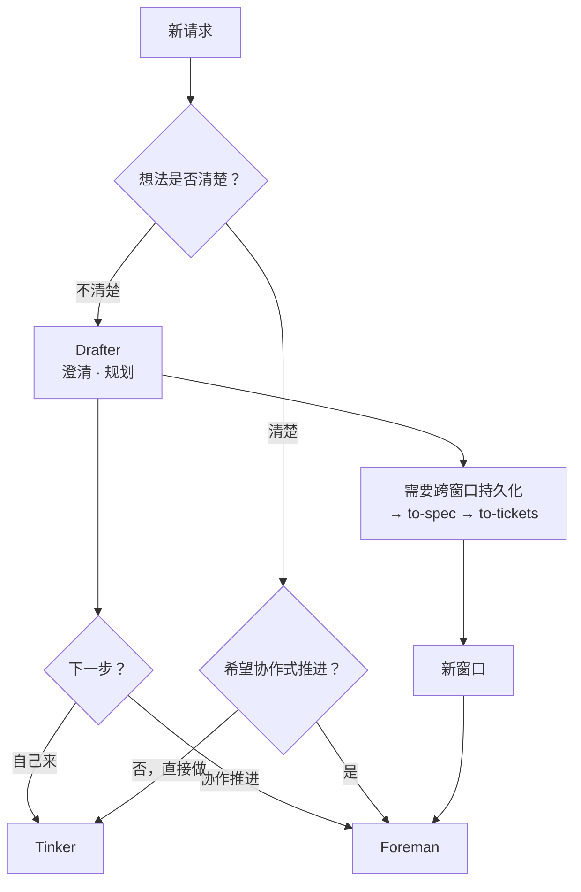
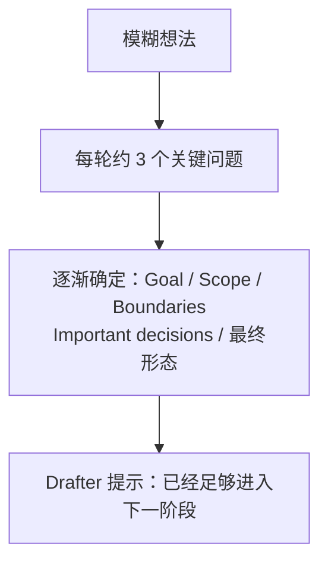
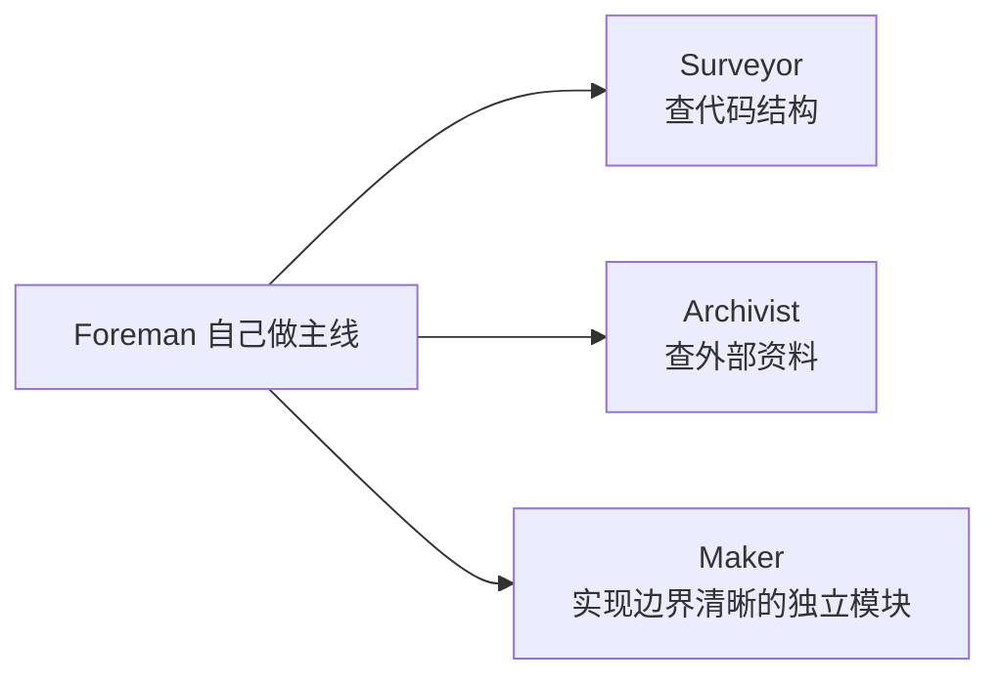
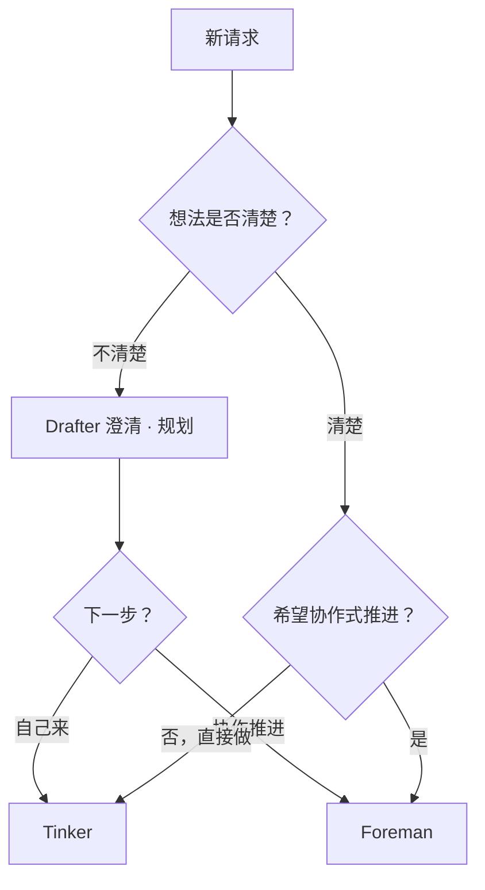

# OpenCode Matt Workshop

独立的 OpenCode Server 插件：以 Matt Pocock Skills `v1.2.3` 的全部 25 个 Promoted Skills 为基础，提供一套**克制、手动控制、按需增加能力**的 OpenCode 工作流。

这不是一个"自动判断任务复杂度然后自己切档"的大框架。核心只有三个角色，由你手动选择：

- **Drafter** — 把事情想清楚（澄清决策、产出规划产物）；**不实施**
- **Tinker**（默认）— 通用助手：解释、讨论、调研、设计交流、实现、调试都能做；可委派
- **Foreman** — 协作式实现：主线自持，主动识别可并行的独立工作并整合结果


```mermaid
flowchart TD
    A[新请求] --> B{想法是否清楚？}
    B -- 不清楚 --> C[Drafter<br/>澄清 · 规划]
    C --> D{下一步？}
    D -- 自己来 --> E[Tinker]
    D -- 协作推进 --> F[Foreman]
    B -- 清楚 --> G{希望协作式推进？}
    G -- 否，直接做 --> E
    G -- 是 --> F
    C --> Spec["需要跨窗口持久化<br/>→ to-spec → to-tickets"]
    Spec --> NewWindow["新窗口"] --> F
```

## Drafter：只负责"我到底想做什么"

Drafter 按 Matt Pocock 的 grilling 思路工作。它不是一上来就写 implementation plan，而是**逐层问真正影响设计的问题**：


```mermaid
flowchart TD
    A[模糊想法] --> B[每轮约 3 个关键问题]
    B --> C["逐渐确定：Goal / Scope / Boundaries<br/>Important decisions / 最终形态"]
    C --> D["Drafter 提示：已经足够进入下一阶段"]
```

**不自动切换角色，也不替你实施。** 关键路径就一条：先想清楚，再选实现者。

规划产物**默认直接写在对话里交付**。只有当你明确要求跨窗口持久化时，Drafter 才把内容保存成 spec / tickets：`to-spec` skill → `to-tickets` skill → 新窗口。

| 你的处境 | 选择 |
| --- | --- |
| 不清楚的事情 | Drafter →（自己来 → Tinker / 协作推进 → Foreman） |
| 清楚的事情，直接做 | Tinker（默认） |
| 想有组织地并行推进、分工整合 | Foreman |
| 上下文太长、需要跨窗口持久化 | 明确要求后：`to-spec` skill → `to-tickets` skill → 新窗口 → Tinker / Foreman `implement` skill |

`to_spec → to_ticket` 是**按需**的持久化路径，用来把讨论落盘、然后清空上下文重新执行；它不是每个任务都必须经过的入口，也与选哪个实现角色无关。

## Tinker：通用助手，低摩擦

Tinker 是默认角色，但不只是"实现角色"：**解释、讨论、调研、设计交流、实现、调试**都在它的范围里，直接从你的请求出发，不需要先有一份正式规划或 ticket。

它自己读代码 → 自己修改 → 自己做廉价检查 → 结束。主线默认自己写，但**委派是通用能力而非等级标志**：出现真正的并行收益，或某个 Worker 明显更合适时，按与 Foreman 相同的规则派 Worker。

默认：

- 不启动 TDD，不扩建测试设施
- 不因为一个简单修改开始补一整套 regression suite
- 不默认启动多方案设计、独立完整 review
- 不把 spec / tickets 当成必经流程
- 不顺手做 Git 提交 / 推送

有价值的少量测试可以做：用来验证一个本身就能独立理解的需求，而不是把"验证"扩张成另一项开发任务。

普通方法自己用；上面这些重量级工作流，只有当你用自然语言明确要求时才启动——**这是提示词层面的行为约定，见下文 Workflow Skills，不是 native 硬 permission。**

验证按成本选择，浓缩成：**Existing + Targeted + Bounded**

> 使用已有的、针对当前修改的、时间有界的检查。已有的、几秒能跑完的检查（能快速 compile 就 compile、有快速 typecheck 就 typecheck、format/lint 几秒可以跑）都值得跑；成本可接受时，跑一次现有的全量检查也合理。一旦"验证"开始变成另一项开发任务——停。

贴近真实行为验证：检查与断言反映代码的真实行为，**不为了让结果变绿而降断言**。

## Foreman：不是 manager，而是"有调度能力的实现者"

Foreman 自己仍然：

- 看代码
- 写主线
- 改文件
- 调试
- 整合结果

**只有 delegation 真的带来收益才叫子 Agent。** 目前确定两个触发理由：

- **A. 可以真正并行**
- **B. specialist 明显更适合**

例如：


```mermaid
flowchart LR
    Main[Foreman 自己做主线]
    Main --> Surveyor["Surveyor<br/>查代码结构"]
    Main --> Archivist["Archivist<br/>查外部资料"]
    Main --> Maker["Maker<br/>实现边界清晰的独立模块"]
```

而不是："我是 Foreman → 所以什么都必须 delegate"。

一句话：**Delegate for leverage, not by default.**

**协作重点是"并行与分工"，不是"多重审查"。** Foreman 不默认在实现后重跑一遍完整 review；只有你明确要求独立完整 review 时，才启动（例如并行两个 Inspector，各审一个轴）。

## Tinker 和 Foreman 的真正区别

不是：

- Tinker = 随便做，Foreman = 严格做
- Tinker = 不测试，Foreman = TDD
- Tinker = 小任务，Foreman = 大任务

而是：

- **Tinker** = 通用助手，默认自己把事做完，委派按同样规则按需发生
- **Foreman** = 主线自持，主动识别可并行的独立工作、协调分工并整合结果的协作式实现

角色选择**与任务大小、是否有 ticket 无关**：想要协作式推进（并行、分工、整合）时选 Foreman，其余情况 Tinker 就够。

两者共用同一套验证原则（Existing + Targeted + Bounded）和同一套权限语义。测试、review、TDD 暂时都**不绑定角色**，由你的自然语言意图显式启动，以后真的遇到问题再加。

> 先不要设计一个完整理论体系；缺什么，加什么。

## 高风险动作与 Git

Tinker 与 Foreman 对高风险操作默认走 **native `ask`**：命中规则时由原生权限层弹确认，你确认后才执行——这是真实生效的 native 权限，不只是提示词约定。

- 你自己已有 / 后加的权限规则按顺序优先于内置默认，插件不替用户关掉确认。
- 项目之外的路径不再默认放开：访问外部目录可能同样弹确认，以用户实际 native 配置为准。
- 内置默认以一组固定顺序的规则前缀表达（兼容约定）；当无法区分某个确认来自内置默认还是你既有规则时，保守保留既有确认，不擅自放宽。具体规则不必记，看到弹窗按自己判断放行或拒绝即可。
- 与“重型工作流只在明确意图下启动”不同：后者是提示词层约定（见下文 Workflow Skills），前者是 native 权限默认。

Git 提交 / 暂存 / 推送 / 改写历史仍然只在你明确要求具体动作时才做；没有任何角色会自己顺手提交。

## Worker 边界

- **不做 worktree orchestration**：所有子 Agent 共享同一个 repo / working tree。
- 依靠提示词约束 Worker：只修改 assigned scope、不随便动其他模块、不 revert 别人的修改、不自行 commit / reset、发现冲突就报告。
- 最后由发起委派的 Primary Agent 做 Git coordination：`git diff` → 看各 agent 修改 → 简单检查 → 整合。
- 第一版不做复杂 worktree management。

### 只读角色怎么取证

硬性 native 限制只有纯 deny：Drafter / Inspector / Surveyor / Archivist 的 shell 为 deny，Inspector / Surveyor 的 `edit` 为 deny，Worker 不递归委派（task deny）。Drafter 可写 Markdown / HTML 规划产物、Archivist 只写指派的 Markdown 报告——这些编辑范围是 **policy 默认**，用户可以用显式权限规则覆盖，但提示词里的职责要求不变。

只读调查靠 `read` / `glob` / `grep` / `list` / webfetch / websearch 这类只读工具完成，不通过 shell 绕开写入限制。

需要命令输出、diff 或测试结果时，由保留 shell 能力的实施主 Agent（Tinker / Foreman）执行，并把相关输出放进委派 brief；只读 Worker 不自行跑命令，也不因为 brief 里贴了命令输出就顺带改文件。

这是**职责边界**，不是完整 OS sandbox，也不虚构基于 MCP 的完备沙箱：它约束的是"这个角色该做什么"，不承诺阻断所有副作用路径。实际弹不弹确认、哪些路径要确认，以用户自己的 native 权限配置为准。

## 子 Agent 必须有生命上限

组合使用：

| 层 | 机制 |
| --- | --- |
| Agent | `steps` 上限 |
| Shell | `timeout`（单条命令不能无限执行） |
| Prompt | 连续尝试没有产生新信息 → 不要机械重试，返回汇报阻塞点 |

形成：**soft no-progress limit + hard ceiling**。

只有以后依然出现严重 stall，才值得写真正的 progress watchdog（检测 diff / error / progress，然后 abort child session）。**现在不做。**

## 设计原则（总结）

- Thinking 和 implementation 分开。
- 是否委派是 implementation strategy，不是质量等级。
- Drafter 不自动替你决定下一步，也不替你实施。
- Tinker 是通用助手，追求低摩擦；委派是通用能力。
- Foreman 自己干主线，主动识别真正可并行的独立工作，重在协作而非重审查。
- TDD、独立完整 review、多方案设计、spec tickets 只在你的明确意图下启动（提示词层约定，不是硬权限）。
- 不默认 TDD，不默认扩建测试设施。
- 验证贴近真实行为，不为变绿降断言。
- 验证成本不能反客为主。
- Worker 不能无限运行。
- 高风险动作先问；Git 操作只在明确要求时做。
- 不先造完美框架，实际遇到 friction 再增加机制。

## 角色与当前实现

本插件注册三个 Primary Agent 与四个 Worker Subagent：

| 角色 | 配置键 | 职责 |
| --- | --- | --- |
| Drafter | `drafter` | 澄清决策、逐层问关键问题、产出规划产物；不实施；默认对话交付，按需持久化 |
| Tinker | `tinker`（默认） | 通用助手：解释 / 讨论 / 调研 / 设计交流 / 实现 / 调试，可按需委派；Existing + Targeted + Bounded 验证 |
| Foreman | `foreman` | 主线自持，主动识别可并行的独立工作并协调整合；不默认重审查 |

另注册四个边界明确的 Worker Subagent 供委派：`maker`（实施有界单元）、`inspector`（只读审查）、`archivist`（调研并写报告）、`surveyor`（只读代码映射）。Worker 默认 steps 为 Maker 40、Inspector 24、Archivist 20、Surveyor 32；持续无进展（拿不出新证据、失败也没有收窄）时停止重试并汇报阻塞点。

## Configuration

最简配置：

```jsonc
{
  "$schema": "https://opencode.ai/config.json",
  "plugins": [
    "./opencode-zh-bundle/plugins/opencode-matt-workshop"
  ]
}
```

可选的角色覆盖只支持 `model`、`variant`、`temperature`、`steps`：

```jsonc
{
  "plugins": [
    {
      "package": "./opencode-zh-bundle/plugins/opencode-matt-workshop",
      "options": {
        "agents": {
          "drafter": { "model": "openai/gpt-5.6-sol", "variant": "high" },
          "tinker": { "model": "opencode-go/deepseek-v4-flash", "variant": "high" },
          "foreman": { "model": "openai/gpt-5.6-terra", "variant": "high" },
          "maker": { "model": "opencode-go/deepseek-v4-flash", "variant": "max" },
          "inspector": { "model": "opencode-go/mimo-v2.5" },
          "archivist": { "model": "openai/gpt-5.6-luna", "variant": "medium" },
          "surveyor": { "model": "opencode-go/mimo-v2.5" }
        }
      }
    }
  ]
}
```

这些模型只是推荐，不是运行时默认值。未配置时，每个角色继承 OpenCode 当前模型。DeepSeek V4 Flash 不能接收图片或 PDF；附件任务应临时覆盖为支持附件的模型。`opencode-go/mimo-v2.5` 无 variant 档（只有默认），配置时省略 `variant` 字段；有 variant 档的模型（如 deepseek-v4-flash 的 low/high/max）才写 variant。

## How to use

### 使用流程一览


```mermaid
flowchart TD
    A[新请求] --> B{想法是否清楚？}
    B -- 不清楚 --> C[Drafter 澄清 · 规划]
    C --> D{下一步？}
    D -- 自己来 --> E[Tinker]
    D -- 协作推进 --> F[Foreman]
    B -- 清楚 --> G{希望协作式推进？}
    G -- 否，直接做 --> E
    G -- 是 --> F
```

### 第一步：安装

1. 把插件加入 `~/.config/opencode/opencode.jsonc` 的 `plugins` 数组（见 [Configuration](#configuration)，对象式 options 可配模型），并按 bundle 模板声明七个 agents 占位项。
2. OpenCode v2 会重载受监视的配置；未受监视的本地依赖变更后重启服务。
3. 验证：`opencode debug agent tinker` 应显示 Tinker 角色。

### 第二步：进入 Drafter（想清楚）

1. 在 OpenCode TUI 中切换到 `drafter`（Drafter）。
2. 用自然语言描述你的模糊想法，不用先整理好。
3. Drafter 会按 grilling 思路**每轮问约 3 个关键问题**，逐层逼近真正影响设计的东西。
4. 回答几轮后，Drafter 提示"已经足够进入下一阶段"。
5. **切换由你手动完成**——Drafter 不会自动开始实现。
6. 规划产物默认在对话里交付；要落盘成 spec / tickets 就明确说一声。

### 第三步：选择实现路径

#### 路径 A：Tinker（自己来）

- **场景**：想直接完成的解释、讨论、调研、改动或调试；不打算并行分工。
- **怎么切**：TUI 切换到 `tinker`（默认就是它，通常无需切换）。
- **它会**：直接读代码 / 查资料 → 回答、讨论或修改 → 按成本跑已有的廉价检查 → 结束；遇到真并行或 specialist 更合适的部分，按 leverage 委派 Worker。
- **边界**：默认不启动 TDD、不扩建测试设施、不启动重量级工作流；一旦"验证"开始变成另一项开发任务就停。

#### 路径 B：Foreman（协作推进）

- **场景**：希望有组织地并行推进、分工与整合（例如同时实现多个边界清晰的模块、并行调研、并行审查）。
- **怎么切**：TUI 切换到 `foreman`。
- **它会**：自己写主线；只有"真并行"或"specialist 明显更合适"时才派 Worker。
- **委派前**：声明 Delegation Leverage、Assigned Scope、预期结果。
- **不默认**：实现完成后不自动重跑一遍完整 review；要独立审查就明确说。

#### 路径 C：持久化后跨窗口继续（清空上下文）

context 太长、你要换窗口继续，并明确要求把讨论落盘时：

1. 在 Drafter 中运行 `to-spec` skill —— 把已讨论内容合成规格。
2. 运行 `to-tickets` skill —— 拆成带阻塞关系的 tickets。
3. 开新窗口，切换到 Tinker 或 Foreman 运行 `implement` skill。
4. 新窗口的角色根据 spec / tickets 实施，旧 context 不再拖累。

`to-spec` skill → `to-tickets` skill 不是每个任务都必须经过；它专门解决"要跨窗口继续 + 明确要求持久化"。

### 第四步：Worker 一览（委派或直接调用）

| Worker | 做什么 | 何时用 | 访问方式 |
| --- | --- | --- | --- |
| `maker` | 实施一个边界清晰的独立模块 | 需要并行实现 | 由 Tinker 或 Foreman 委派 |
| `inspector` | 只读审查 Standards / Spec 一个维度 | 你明确要求独立审查时 | 由 Tinker 或 Foreman 委派（可两个并行） |
| `archivist` | 调研一手资料并写带引用的报告 | 需要外部资料、文档、API 事实 | 可见，可直接 `@archivist`；也可由 Primary Agent 委派 |
| `surveyor` | 只读映射代码结构、约定与关系 | 需要先摸清代码库再动手 | 可见，可直接 `@surveyor`；也可由 Primary Agent 委派 |

所有 Worker：共享 working tree、只改 assigned scope、不自行 commit/reset、持续无进展即停止汇报、受 `steps` 上限约束。

### 常用技能一览

| 技能 | 用途 | 何时用 |
| --- | --- | --- |
| `ask-matt` skill | 让插件推荐当前处境最合适的 Skill | 不确定该用哪个工作流 |
| `implement` skill | 按对话里的规划 / spec / tickets 实施 | Tinker 或 Foreman 下运行 |
| `to-spec` skill | 把当前对话合成规格并发布到 tracker | 明确要求跨窗口持久化第一步 |
| `to-tickets` skill | 把规格拆成带阻塞关系的 tickets | 明确要求跨窗口持久化第二步 |
| `tdd` skill | 测试驱动开发 | 仅当你明确要求 TDD 或选定 seams/behaviors 后 |
| `code-review` skill | Standards + Spec 双轴审查 | 你明确要求独立完整 review 时 |
| `codebase-design` skill | 同一模块多种接口的多方案设计 | 仅在你明确要求比较多方案时 |
| `diagnosing-bugs` skill | 带证据的 bug 定位流程 | 明确要求走排障流程时 |
| `matt-handoff` skill | 生成交接文档供新会话继续 | 需要换窗口 / 换 Agent |

### 验证边界速查

| 层级 | Tinker | Foreman |
| --- | --- | --- |
| 验证方式 | 已有的、针对当前修改的、时间有界的；成本可接受时可用现有的全量检查 | 同左；委派 Worker 时各 Worker 自带验证 |
| 测试 | 不默认 TDD、不扩建测试设施；有价值的少量测试可做 | 同左 |
| 重量级工作流 | 不默认启动，明确要求才做 | 同左 |
| 停止条件 | 验证变成另一项开发任务 → 停 | 同左 |
| Worker | 按 leverage 调用，受 steps / timeout / no-progress 约束 | 同左 |
| 高风险动作 / Git | 高风险先确认；Git 只在明确要求时执行 | 同左 |

### 常见问题

- **角色会不会自动切换？** 不会。Drafter 只提示"已足够进入下一阶段"，切换永远由你手动完成。
- **为什么默认是 Tinker？** 它是通用助手，低摩擦优先；想协作式并行推进时手动切 Foreman。两个角色都能按同样规则委派 Worker。
- **Foreman 是不是只管大任务？** 不是。角色与任务大小无关，只取决于你想不想协作式推进。
- **Tinker 不写测试吗？** 默认不启动 TDD、不扩建测试设施；有价值的少量测试完全可以写。
- **想独立审查怎么办？** 明确说一声即可：按约定 Tinker 和 Foreman 都可以并行两个 Inspector，各审一个轴后汇总（提示词层约定，不保证绝对触发）。
- **规划结果存在哪里？** 默认在对话里；只有你明确要求时才保存 spec / tickets。
- **Foreman 会自动再审查一遍吗？** 不会。默认只做实现与整合；独立完整 review 由你明确要求后启动。
- **怎么给角色配模型？** 见 [Configuration](#configuration) 的 tuple options。
- **Worker 卡住了怎么办？** 有 steps + timeout + no-progress 上限，会自行停止并汇报阻塞点；严重时可重启会话。
- **必须每次都用 Drafter 吗？** 不是。只有想法模糊时才需要；清晰的请求可以直接在 Tinker / Foreman 开始。

## Workflow Skills

- 全部 25 个 Promoted Skills 仅注册为 OpenCode V2 Skill，不注册斜杠命令；handoff 的 Skill ID 为 `handoff`。
- `implement` skill 在 Tinker 中默认自执行；在 Foreman 中实施主线并可并行委派。
- 实现后的 Standards / Spec 双轴审查**不默认运行**，只在你明确要求时启动：Tinker 和 Foreman 都可以并行两个 Inspector，各审一轴后汇总。
- `tdd` skill 是 opt-in：先让你选定 seams / behaviors 再写测试，直接调用 `tdd` skill 也必须先确认范围。
- `to-spec` / `to-tickets` 是按需持久化路径，只在明确要求跨窗口时使用。
- 所有 Worker 使用共享 working tree；Primary Agent 在委派前声明 Delegation Leverage、Assigned Scope 和预期结果。
- **以上"只在明确要求时启动"都是提示词层面的行为约定，不是 native 硬 permission。** 插件不承诺绝对触发保证。25 个技能均已 advertise，上游的 `disable-model-invocation` 已被转换成对使用条件的要求写进描述，不再作为隐藏技能的手段；重型工作流是否启动，取决于你的明确要求与各自的描述条件。native 权限弹窗以用户实际配置为准。请把它当作默认行为预期，不是强制边界。

## Reproducible adaptation

上游快照固定为 Matt Pocock Skills `v1.2.3`、commit `6acc160e4e0cd062dbbbd7a1b26ae92855edf07e`（仍是 25 个 Promoted Skills）；快照本体只保留在源码仓库，不随安装包分发。`skills/`、`skill-manifest.json` 和 `dist/` 都是生成物，不要手改。

换上游版本时用 `--vendor --source` 指向上游快照目录导入（这一步会把快照拷进 `vendor/` 并刷新 provenance）：

```bash
node scripts/sync-matt-skills.mjs --vendor --source /path/to/skills-1.2.3
```

日常重新生成只需：

```bash
npm run sync:matt-skills
npm run build:matt-workshop
```

本地技能源目录 `local-skills/` 只存在于源码仓库，存放手写的本地技能（当前是本地实现的 `ask-matt`）。它**不随运行包分发**：staging 把 `local-skills` 列为 matt-workshop 的禁入项，误入会直接让发行隔离校验失败。

日常生成会**自动优先读取** `local-skills/` 里的本地技能，覆盖同名上游技能后再写入生成目录——**输出路径不变**，仍是 `skills/<name>`。因此不需要、也不应当把 `--source` 指向 `local-skills`；`--source` 只用于导入上游快照目录。

Workshop 不保留自动化测试套件或 CI 门禁：同步后由构建命令重新生成 `dist/`，行为正确性靠重启 OpenCode 后人工检查。

OpenCode v2 会重载受监视的配置与插件；未受监视的本地依赖变更后重启服务。

## Architecture

- **独立原生插件。** 通过 OpenCode 的 config hook 注册自己的 Primary 与 Worker Agent，只使用原生权限、任务委派、可见性与 `steps` 上限；不依赖其他 agent 包，也不实现调度器、worktree 管理、命令执行器、Hook 层或持久任务运行时。
- **可复现适配边界。** 固定版本的上游快照 + 显式适配规则 + 提交进仓库的生成 Skill；开发知识资产（领域语言、设计决策）与上游快照都不进入安装包分发的运行集。
- **源码目录与运行目录分离。** `vendor/`、`src/`、`local-skills/` 与 `docs/` 内部设计都只属于源码仓库；运行包只含 `dist/`、`skills/`、`licenses/`、`skill-manifest.json` 与入口文件。
- 其余取舍见上文[设计原则](#设计原则总结)。

合并到已有 OpenCode 配置的方法见 [`docs/MERGE_EXISTING_CONFIG.md`](../../docs/MERGE_EXISTING_CONFIG.md)。

这是非官方 OpenCode adapter。Matt Pocock 的 vendored Skills 保留上游 MIT 许可证和 provenance。
